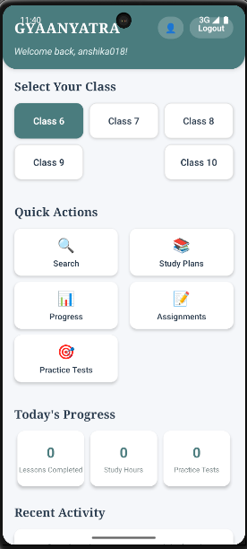
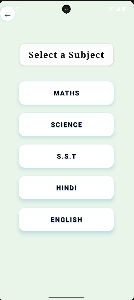
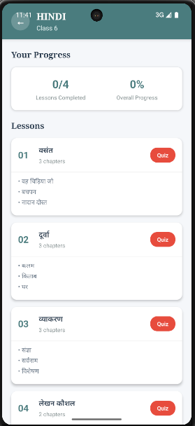

# GyaanYatra - Complete Educational Mobile App

A comprehensive React Native educational application designed to provide interactive learning experiences for students from Class 6 to Class 10.

**Author**: Kriti Purwar, Anshika Srivastava, Gauri Singh

### Home Screen

### Selection Page

### Login Page

### Getting Started
1. **Sign Up**: Create a new account with name, class, and phone number
2. **Sign In**: Log in with your username
3. **Dashboard**: Access all features from the main dashboard
4. **Select Subject**: Choose from Math, Science, English, Hindi, or Social Studies
5. **Browse Content**: Explore lessons and chapters
6. **Take Quizzes**: Test your knowledge with interactive quizzes
7. **Track Progress**: Monitor your learning progress

### Key Features Usage

#### Dashboard Navigation
- **Class Selection**: Choose your current class (6-10)
- **Quick Actions**: Access Search, Progress, and other tools
- **Subject Cards**: Direct access to subject content

#### Learning Flow
1. Select a class from the dashboard
2. Choose a subject from the subject selection screen
3. Browse available lessons
4. Study lesson content with detailed explanations
5. Take quizzes to test understanding
6. Track progress in the Progress Tracker

#### Search Functionality
- Search by subject, lesson title, or keywords
- Browse by subject categories
- View recent and popular searches
- Quick access to search results

#### Progress Tracking
- **Overview**: Overall progress and statistics
- **Weekly**: Visual progress charts
- **Achievements**: Unlock learning milestones

## 🎯 Educational Content

### Subjects Covered

#### Mathematics (Classes 6-10)
- **Class 6**: Numbers, Whole Numbers, Playing with Numbers, Geometry
- **Class 7**: Integers, Fractions, Data Handling, Simple Equations
- **Class 8**: Rational Numbers, Linear Equations, Quadrilaterals
- **Class 9**: Number Systems, Polynomials, Coordinate Geometry
- **Class 10**: Real Numbers, Polynomials, Arithmetic Progressions

#### Science (Classes 6-10)
- **Class 6**: Food sources, Components of Food, Fibre to Fabric
- **Class 7**: Nutrition in Plants/Animals, Heat, Acids and Bases
- **Class 8**: Crop Production, Microorganisms, Synthetic Fibres
- **Class 9**: Matter, Atoms and Molecules, Cell Biology
- **Class 10**: Chemical Reactions, Acids/Bases/Salts, Life Processes

#### English (Classes 6-7)
- Literature comprehension
- Grammar fundamentals
- Writing skills development
- Poetry appreciation

#### Hindi (Classes 6-7)
- व्याकरण (Grammar)
- गद्य और पद्य (Prose and Poetry)
- लेखन कौशल (Writing Skills)

### Subject Page

#### Social Studies (Classes 6-8)
- **History**: Ancient civilizations, Medieval period
- **Geography**: Earth and environment, Natural resources
- **Civics**: Government, Constitution, Society

## 💾 Data Management

### Local Storage
The app uses AsyncStorage to persist:
- User profile information
- Learning progress for each lesson
- Quiz scores and attempts
- Personal study notes
- App settings and preferences
- Achievement unlocks

## 🔧 Development

### Adding New Content
1. **New Subjects**: Update content in `SubjectContent.jsx`
2. **New Lessons**: Add to the content mapping functions
3. **New Quiz Questions**: Extend the quiz generation system
4. **New Features**: Follow the existing component structure

### Component Architecture
- **Functional Components**: Using React Hooks
- **Navigation**: Stack-based navigation with React Navigation
- **State Management**: Local state with useState and useEffect
- **Data Persistence**: AsyncStorage for local data
- **Styling**: StyleSheet for component styling

---

**Happy Learning with GyaanYatra! 🎓📚**